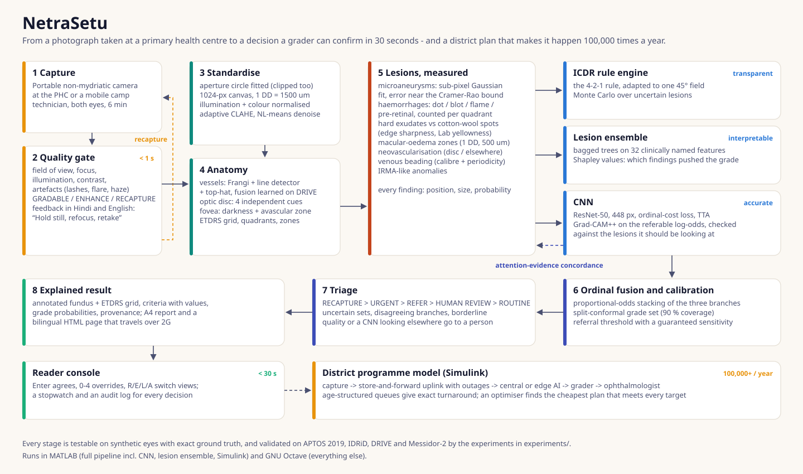
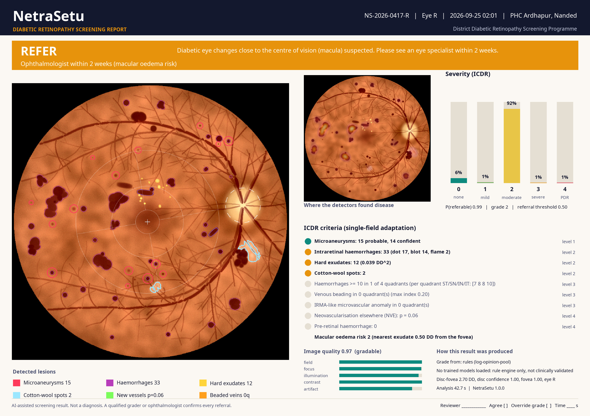
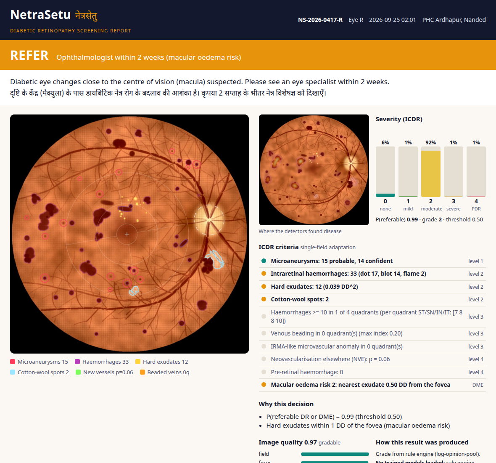
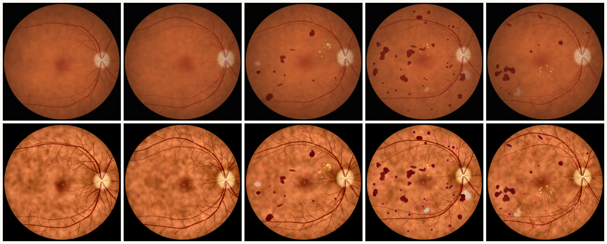
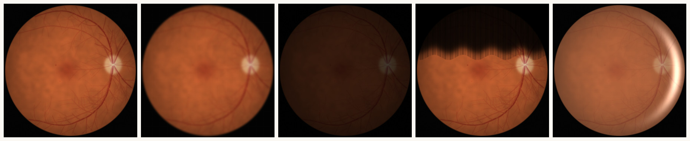
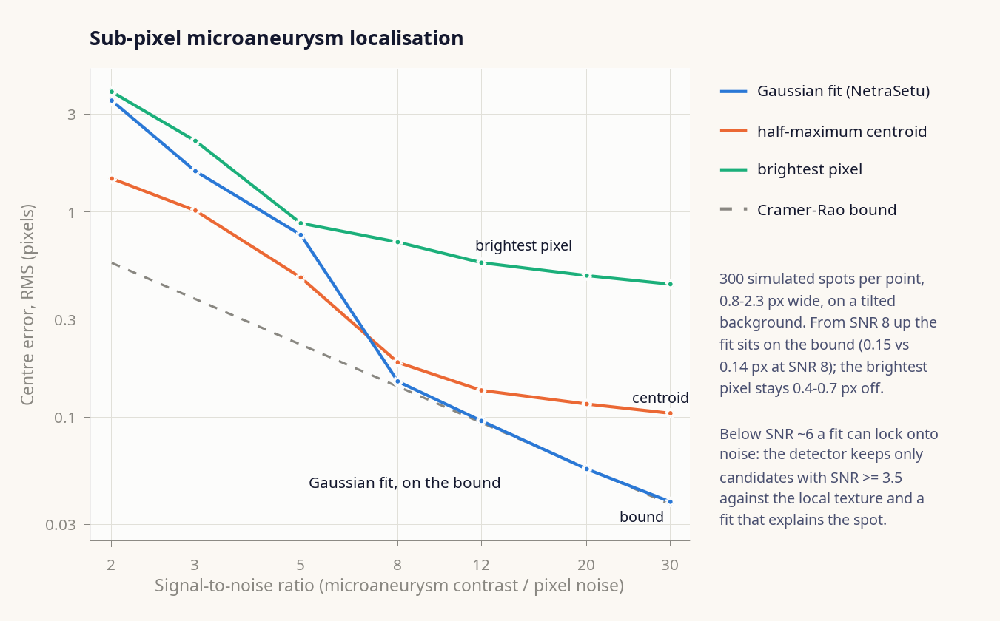
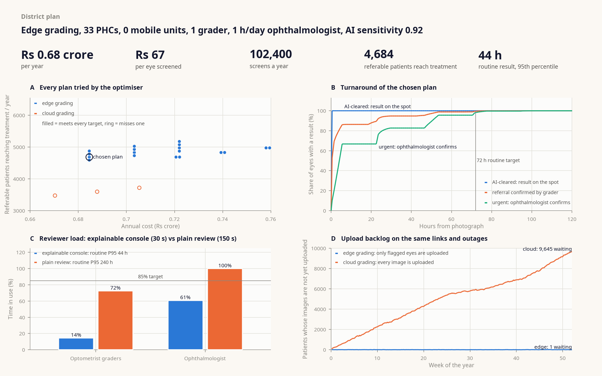
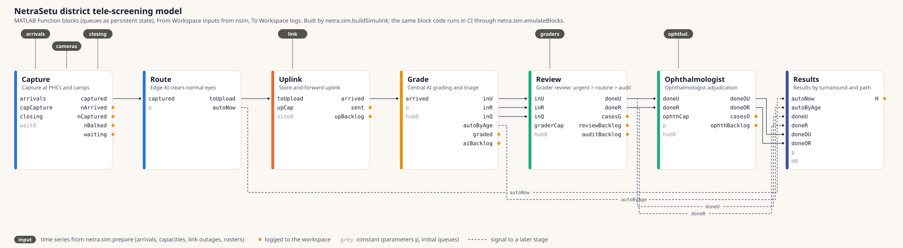

<div align="center">

# NetraSetu &nbsp;·&nbsp; नेत्रसेतु

**A bridge for the eyes: explainable diabetic-retinopathy screening for rural India, from one photograph to a whole district.**

MATLAB · Image Processing · Computer Vision · Deep Learning · Statistics & ML · Simulink &nbsp;|&nbsp; also runs in GNU Octave

</div>

<p align="center"></p>

A technician at a primary health centre photographs both eyes of a person with
diabetes. Within seconds NetraSetu says whether the photograph is good enough
(and, in Hindi or English, what to fix if it is not), finds the optic disc,
fovea and vessels, **measures** every lesion the international grading scale
is written in — microaneurysms to a fraction of a pixel, haemorrhages by type
and quadrant, exudates by distance from the fovea, new vessels — grades the
eye three independent ways, fuses the grades with calibrated uncertainty, and
produces a one-page report a grader can confirm in under 30 seconds. A
Simulink model of the district programme then answers the question the
district health officer actually has: *how many cameras, links, graders and
ophthalmologist hours does it take to screen 100,000 people a year, and what
does it cost?*

> **Status, honestly.** Everything below the line "measured here" was run in
> this repository. The clinical accuracy figures (sensitivity, specificity,
> AUC on APTOS 2019, IDRiD and Messidor-2) are produced when you run
> `experiments/run_all.m` with the datasets, which are licensed and cannot be
> redistributed; the analysis plan is fixed in
> [`docs/VALIDATION.md`](docs/VALIDATION.md) and the results are assembled into
> a self-contained validation dossier. No number in this README is a clinical
> accuracy claim.

---

## What it does

| | |
|---|---|
| **1 · Quality gate** | Five interpretable sub-scores — field, focus, illumination, contrast, artefacts — and a minimum-sub-score rule. *GRADABLE*, *ENHANCE* (enhanced, re-assessed, and sent to a person if still borderline) or *RECAPTURE* with the reason, in the technician's language. |
| **2 · Standardise** | Aperture circle recovered even when a camera clips it; 1024-px canvas where 1 disc diameter ≈ 1500 µm; illumination and colour normalised (every lesion threshold is a contrast in *% darker than the local retina*); adaptive CLAHE; denoising only when noise is measured to be high. |
| **3 · Anatomy** | Vessels by three complementary detectors (Frangi, multiscale line detector, linear top-hat) fused by a model learned on DRIVE; optic disc from four independent cues; fovea; ETDRS grid, quadrants and macular zones. |
| **4 · Lesions, measured** | Microaneurysms fitted with a sub-pixel Gaussian (error at the Cramér–Rao bound); haemorrhages as dot / blot / flame / pre-retinal, counted per quadrant; hard exudates vs cotton-wool spots; macular-oedema zones; neovascularisation on and off the disc; venous beading; IRMA-like anomalies. |
| **5 · Three graders** | An ICDR **rule engine** (the 4-2-1 rule, re-fitted for one 45° field, run as a Monte-Carlo over uncertain lesions) · a **lesion ensemble** on 32 clinically named features with Shapley explanations · a **CNN** (ResNet-50, ordinal-cost loss, test-time augmentation, temperature-scaled). |
| **6 · Fusion & uncertainty** | Proportional-odds stacking of the branches; split-conformal grade sets with 90 % coverage; a referral threshold whose sensitivity is *guaranteed* by the lower bound of its Wilson interval, not just its point estimate. |
| **7 · Triage** | RECAPTURE › URGENT › REFER › HUMAN REVIEW › ROUTINE. An eye is auto-cleared only when nothing is uncertain: a grade set straddling the referral boundary, disagreeing branches, borderline quality, anatomy not found, or a CNN looking somewhere other than the lesions all go to a person. |
| **8 · Explanation** | Grad-CAM++ on the log-odds of *referable* DR, checked against the classical lesion evidence (attention–evidence concordance); every ICDR criterion with its measured value and threshold; A4 report and a 0.3 MB bilingual HTML report; a keyboard-first Reader Console with a 30-second stopwatch and an audit log. |
| **9 · District model** | Hour-by-hour simulation of a year — Poisson demand with seasons and holidays, cameras, Markov link outages, edge vs cloud AI, graders and ophthalmologist — as a Simulink model and a MATLAB reference that share every line of stage code; an optimiser finds the cheapest plan that meets every target. |

## See it

<table>
<tr><td width="50%"></td>
<td width="50%"></td></tr>
<tr><td><b>The report</b> a grader confirms: triage and follow-up, annotated fundus with ETDRS grid and every lesion, attention map, grade probabilities with the conformal set, the ICDR criteria that fired with their values, image quality, provenance.</td>
<td><b>The same result as a self-contained HTML page</b> (English and हिन्दी, images embedded, ~0.3 MB) that opens on an ASHA worker's phone over 2G.</td></tr>
</table>

<p align="center"></p>
<p align="center"><sub>Synthetic eyes, ICDR 0 → 4 (top), rendered with a physical model — pigmented background, Beer–Lambert blood, reflectance deposits, camera optics and noise — so every lesion is known exactly; NetraSetu's annotation of each (bottom). Rings: microaneurysms; violet outlines: haemorrhages; yellow: exudates; ice blue: cotton-wool spots; green box: new vessels; grid: ETDRS. Triage: 0 and 1 → ROUTINE, 2, 3 and 4 → REFER. The grade-4 eye is referred but not flagged URGENT: its new vessels were not detected — neovascularisation is the least mature detector, which is why PDR also rests on the CNN branch and on human review.</sub></p>

<p align="center"></p>
<p align="center"><sub>The quality gate on the same eye captured five ways: sharp → <b>GRADABLE</b> (0.97) · defocused → <b>RECAPTURE</b>, <i>“Out of focus: clean the lens, ask the patient to keep still, refocus on the vessels at the disc.”</i> · under-exposed → <b>ENHANCE</b> (enhanced and re-assessed; a person sees it if it is still not clean), <i>“Too dark: dim the room lights, let the pupil enlarge, or increase the flash.”</i> · lid and lashes → <b>RECAPTURE</b> · corneal flare with haze → <b>RECAPTURE</b>, <i>“Shadow or reflection at the edge: ask the patient to open the eye wide and hold the camera steady.”</i> Every message also exists in Hindi.</sub></p>

## Quick start

```matlab
>> netrasetu_setup                              % paths; reports which toolboxes are present
>> demo_netrasetu                               % 5-minute tour on synthetic eyes, no data needed
>> R = netra.screen('eye.jpg');                 % one photograph, end to end
>> netra.xai.reportHTML(R, 'report.html');      % bilingual report
>> netra.ui.ReaderConsole.demo()                % 30-second review (MATLAB)
>> run simulink/build_netrasetu_model           % build, run and check the Simulink model
>> run experiments/run_all                      % validation on the four datasets -> dossier
```

In GNU Octave (8.4 with the `image` and `statistics` packages) everything runs
except the CNN, the lesion ensemble, the Reader Console and Simulink itself —
the grader is then the calibrated rule engine, and the Simulink model's block
code is executed by an emulator. `tests/run_tests` runs the test suite in either.

## Measured here

These results were produced in this repository with GNU Octave 8.4 — on
synthetic data with exact ground truth, or against independent reference
implementations. They verify the engineering, not the clinical accuracy.

| What | Result |
|---|---|
| Test suite (`tests/run_tests`) | **50 / 50 passing** in GNU Octave 8.4 (and on every push, via GitHub Actions) — statistics, dataset readers, grading, explanation, simulation, end-to-end pipeline |
| Statistics vs independent implementations | ROC AUC, average precision, Brier score, quadratic weighted kappa = scikit-learn to 1e-12; Wilson interval and exact McNemar = statsmodels to 1e-12; proportional-odds model = statsmodels `OrderedModel` (max. likelihood) to 2e-4; DeLong SE and paired p = midrank reference (Sun & Xu) to 1e-7 |
| Microaneurysm localisation | RMS centre error **0.15 px at SNR 8 and 0.04 px at SNR 30 — on the Cramér–Rao bound** (0.14 and 0.04 px); the brightest pixel is 0.71 / 0.44 px off and a half-maximum centroid 0.18 / 0.10 px. Below SNR ≈ 6 a fit can lock onto noise, which is why the detector also demands contrast against the local texture |
| Simulink model vs MATLAB reference | block code executed for a simulated year (8,736 hourly steps): **bit-identical** on all 14 logged signals at every step and all 48 KPIs, edge and cloud grading |
| End-to-end on synthetic eyes | healthy eye not referred, severe NPDR referred, defocused photograph sent for recapture; disc within 0.25 DD and fovea within 0.5 DD on healthy and diseased eyes |

<p align="center"></p>

## Validation on real data — run it yourself

`experiments/run_all.m` runs six experiments; each caches per-image results and
resumes, and `netra.eval.dossier` turns them into
`results/validation_dossier.html`.

| Experiment | Data | Question | Headline statistics |
|---|---|---|---|
| `exp01_vessels_drive` | DRIVE | Does fusing the three vessel detectors beat each alone? | pixel AUC, Se/Sp/Acc at a training-set threshold, paired bootstrap + sign test, second observer |
| `exp02_lesions_idrid` | IDRiD | How well are lesions, disc and fovea found? | AUPR per lesion type at native resolution (challenge metric), MA FROC, disc Jaccard, landmark error in DD |
| `exp03_train_grader` | APTOS 2019 + IDRiD train | Train and calibrate every learned part | 4-2-1 re-fit, NV normative model, lesion ensemble, CNN, fusion of every branch combination, conformal and operating point |
| `exp04_validate_grading` | APTOS hold-out, IDRiD test, **Messidor-2** | Is Se > 0.90 and Sp > 0.85 for referable DR reached, and does integration beat each technique on the same eyes? | Se/Sp (Wilson CI) per image and per patient, intention to screen, AUC (DeLong), paired DeLong and McNemar vs every single technique, QWK, calibration, conformal coverage, STARD flow |
| `exp05_explainability` | IDRiD lesion masks | Do the explanations point at the lesions? | pointing game, energy on lesions, lift over a uniform map; reader-console timing |
| `exp06_district_simulation` | — (uses the exp04 ROC) | What does 100,000 screens a year take? | cheapest feasible plan, what-if runs, Simulink cross-check |

The published results the dossier puts next to yours — Gulshan et al. 2016,
IDx-DR (Abràmoff 2016, 2018), the Iowa Detection Program, Voets et al.'s
re-implementation, Gulshan et al. 2019 in Aravind and Sankara Nethralaya,
smartphone-based screening in Chennai and Mumbai, the APTOS 2019 winner, DRIVE
methods, the IDRiD challenge and the screening standards — are in
[`netra.eval.benchmarks`](src/+netra/+eval/benchmarks.m) with their sources;
entries transcribed with less certainty are flagged *verify*.

## The district, simulated

<p align="center"></p>

With the illustrative defaults in [`netra.sim.defaults`](src/+netra/+sim/defaults.m) — 36 PHCs
running diabetes clinics, links from 2G to fibre with outages, an optometrist
reading hub and a tele-ophthalmologist — the optimiser's cheapest plan that
meets every target over a full simulated year is: **grading on the PHC
laptops, 33 PHCs equipped, today's links, one grader and one ophthalmologist
hour per weekday**: 102,400 screens a year, 95 % of routine results within
44.5 h, urgent patients counselled on the spot, about 4,700 referable patients
reaching treatment, for **₹0.68 crore a year (≈ ₹66 per screen)**.

The same year, the same patients, the same outages, one choice changed:

| | grader load | ophthalmologist load | routine result, 95th percentile | referable patients reaching treatment |
|---|---|---|---|---|
| chosen plan | 14 % | 61 % | 44.5 h | 4,684 |
| review **without** the explainable console (150 s instead of 30 s a case) | 72 % | **100 %**, saturated | **over 10 days** | 4,177 |
| every image uploaded and graded **in the cloud** | 13 % | 55 % | **over 10 days**, stuck in the uplink | 3,473 |

Explanation is what makes one grader enough; edge grading is what makes 2G
enough and lets the patient hear the result before leaving the PHC. The
30-second review time is the design target the Reader Console measures, and
every number here is a planning estimate from stated, editable assumptions —
replace them with local data (`experiments/exp06_district_simulation.m`; with a
measured ROC from `exp04` the simulation uses your validated model).

<p align="center"></p>
<p align="center"><sub>The Simulink model, drawn from the same description (<code>netra.sim.simulinkBlocks</code>) that <code>netra.sim.buildSimulink</code> builds the <code>.slx</code> from.</sub></p>

## Repository

```
netrasetu_setup.m        paths, toolbox report          demo_netrasetu.m   the tour
src/+netra/
  screen.m               the whole pipeline for one eye
  +quality/              aperture, quality gate, standardisation, enhancement
  +anatomy/              vessels, optic disc, fovea, ETDRS frame
  +lesions/              microaneurysms (sub-pixel), haemorrhages, exudates/CWS, NV, venous beading
  +grading/              ICDR rules, lesion ensemble, +cnn/, ordinal fusion, conformal, operating point, triage
  +xai/                  Grad-CAM(++), concordance, evidence map, overlay, A4 and HTML reports
  +ui/                   Reader Console
  +eval/                 ROC/DeLong/QWK/Wilson/McNemar/FROC/calibration, benchmarks, dossier
  +sim/                  district model: scenario, stages, KPIs, optimiser, Simulink builder + emulator
  +phantom/              synthetic fundus photographs with exact ground truth
  +io/                   APTOS, IDRiD, DRIVE, Messidor-2 readers
experiments/             exp01 ... exp06, run_all
simulink/                build_netrasetu_model.m (writes NetraSetuTelescreening.slx)
tests/                   run_tests.m + test_*.m (MATLAB script tests; run in Octave too)
docs/                    METHODS · VALIDATION · CLINICAL_SAFETY · img/
data/  models/  results/ where datasets, trained components and outputs go (not committed)
```

**Requirements.** MATLAB R2023b or later with the Image Processing, Computer
Vision, Deep Learning, Statistics and Machine Learning toolboxes and Simulink
(a GPU for CNN training), or GNU Octave ≥ 8 with the `image` and `statistics`
packages for everything that does not need those toolboxes.

## Read more

* [`docs/METHODS.md`](docs/METHODS.md) — what every stage computes, and why
* [`docs/VALIDATION.md`](docs/VALIDATION.md) — the analysis plan the experiments implement
* [`docs/CLINICAL_SAFETY.md`](docs/CLINICAL_SAFETY.md) — intended use, hazards and controls
* [`data/README.md`](data/README.md) — getting the four datasets
* [`models/README.md`](models/README.md) — what training writes and what loads it

NetraSetu is research software, not a medical device. Every referral is
confirmed by a qualified grader or ophthalmologist, and prospective validation
with local graders is required before clinical use.
